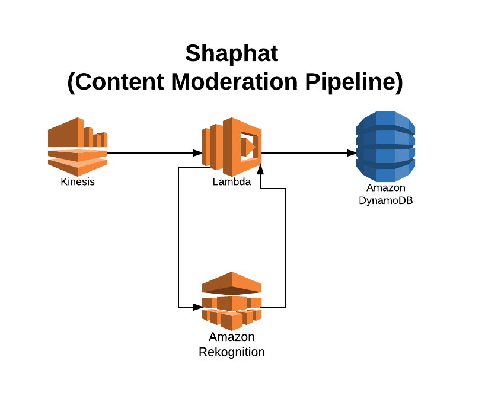
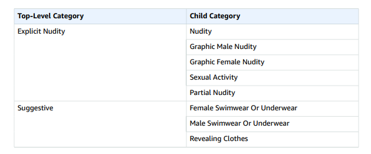

**Shaphat** is a tool that uses Amazon Web Services(AWS) to see if an image contains pornography or other sexually oriented content.

The name Shaphat is Hebrew (***שָׁפַט***) and means to judge or to decide controversy.
[Genesis 19:9](https://www.blueletterbible.org/esv/gen/19/9/s_19009)

The pipeline is designed to retrieve json messages of urls to be checked.

```
{
        "hostname":"flowermeaning.com",
        "imageUrl":"http://www.flowermeaning.com/flower-pics/Orchid-Meaning.jpg"
}
```

Then the lambda is started up with the message and it downloads the bytes of the image and sends it to Amazon Rekognition for image Moderation

Labels:


Lambda then uses the labels and confidence level to save the values in dynamo

The pipeline can scale based on the number of shards in Kinesis, the size of the batch retireved from kinesis, and the size of the lambda runtime used.

To setup the pipeline check the steps in [SettingUpEnv](docs/SettingUpEnv)
