1. With Java installed on the computer build the jar with ./gradlew buildZip
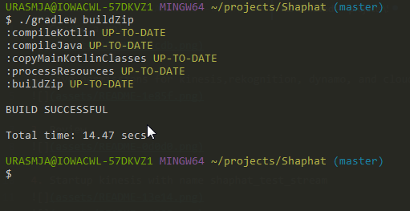

2. After setting up AWS account, create a role
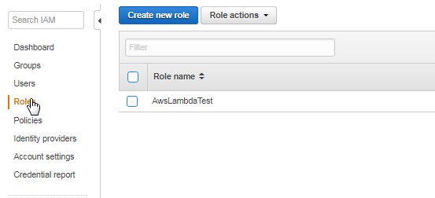

3. Give permissions for kinesis, rekognition, dynamo, and cloudwatch(for logs)
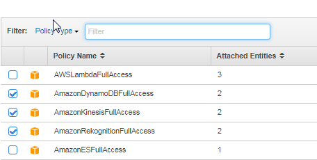

4. Review
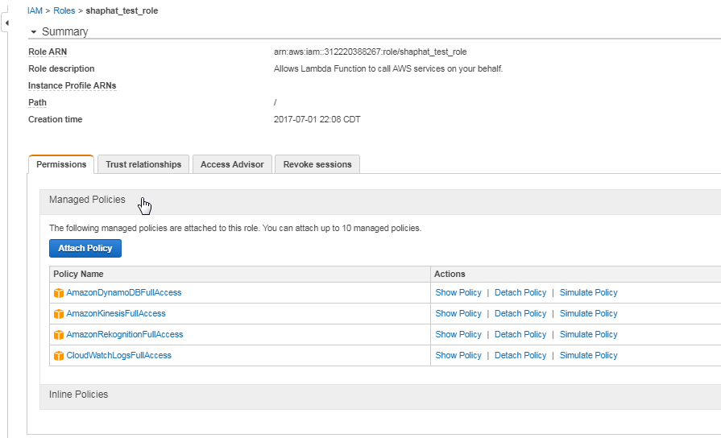

5. Startup kinesis with name shaphat_test_stream
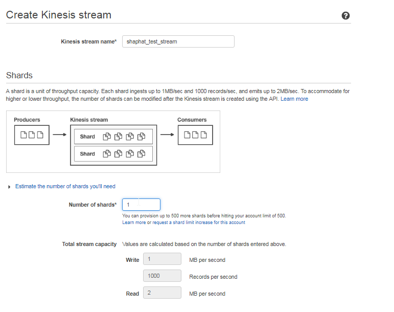
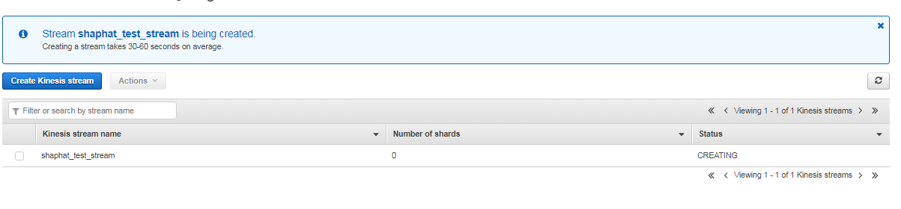

6. Setup dynamo with name shaphat_test(partition key hostname sort_key imageUrl) can change capacity to 1
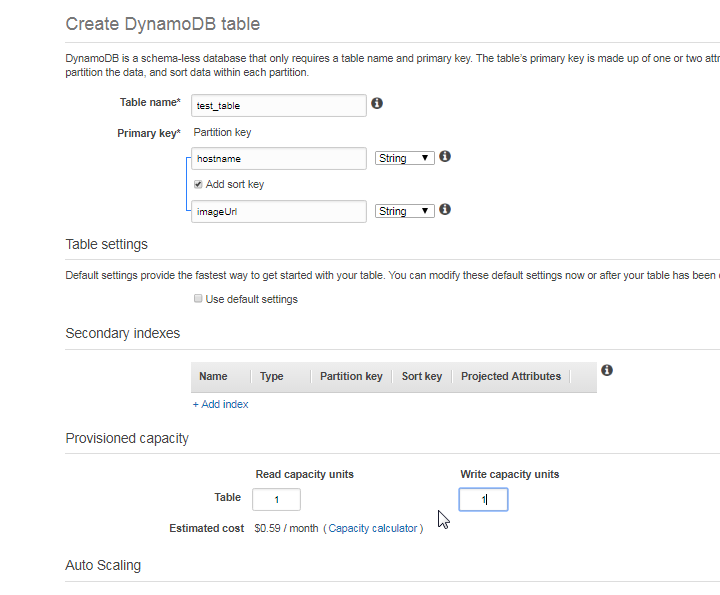

7. Configure lambda use blank function
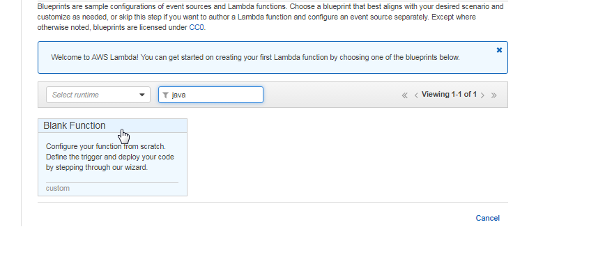

8. Configure trigger as kinesis shaphat_test_stream
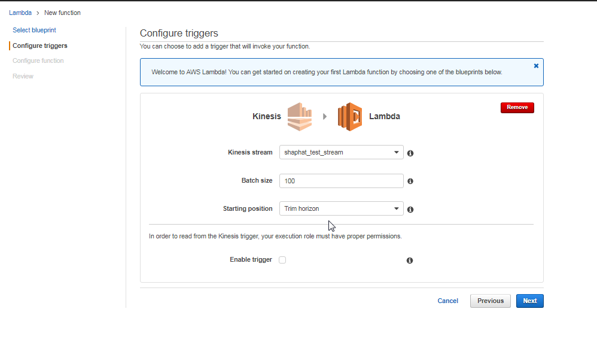

9. Upload Shaphat-1.0.zip jar file and setup env variable(table_name: shaphat_test_table)
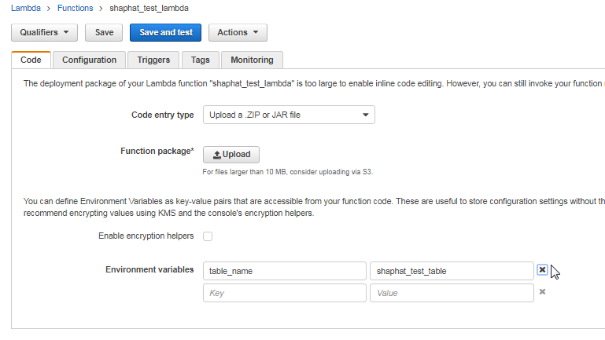

10. Setup configuration to use java8, the created role and setup handler to be LambdaHandler::recordHandler
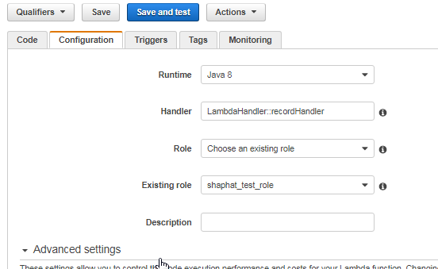

11. Configure test event to kinesis and set kinesis data to "ew0KICAgICAgICAiaG9zdG5hbWUiOiJmbG93ZXJtZWFuaW5nLmNvbSIsDQogICAgICAgICJpbWFnZVVybCI6Imh0dHA6Ly93d3cuZmxvd2VybWVhbmluZy5jb20vZmxvd2VyLXBpY3MvT3JjaGlkLU1lYW5pbmcuanBnIg0KfQ" which base64decodes to { "hostname":"flowermeaning.com", "imageUrl":"http://www.flowermeaning.com/flower-pics/Orchid-Meaning.jpg" }
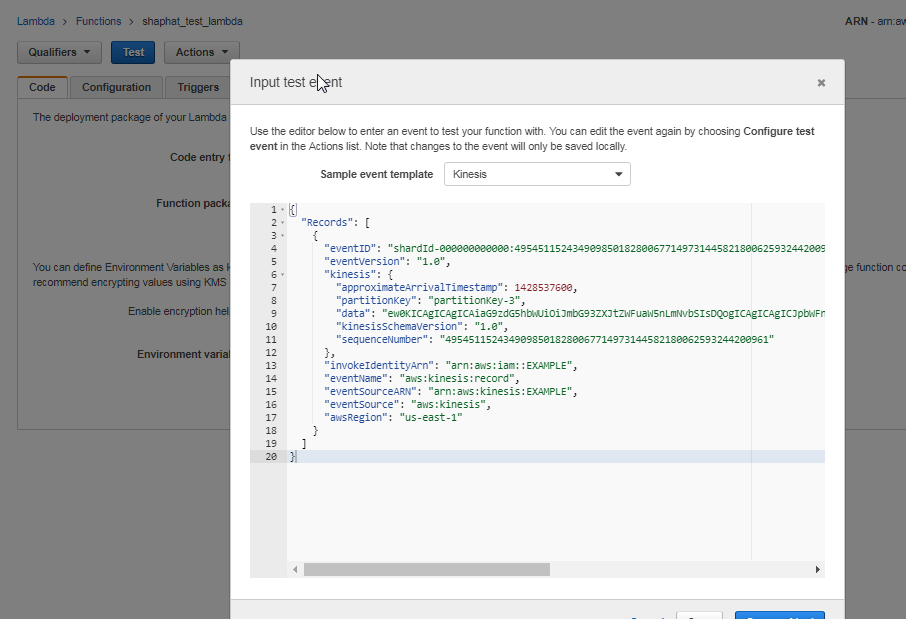

12. Save and test and should get back the log messages that the url and service were called for this one record
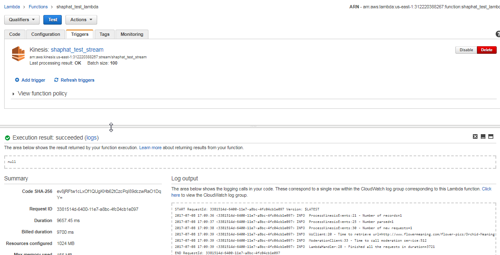

13. Should then be able to see the row in DynamoDb
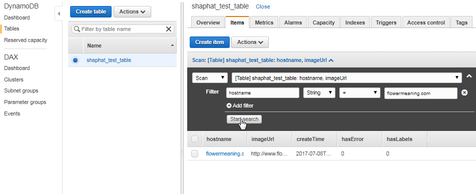

14. Can then use any method to put records in kinesis such as the testScripts/putRecord.sh
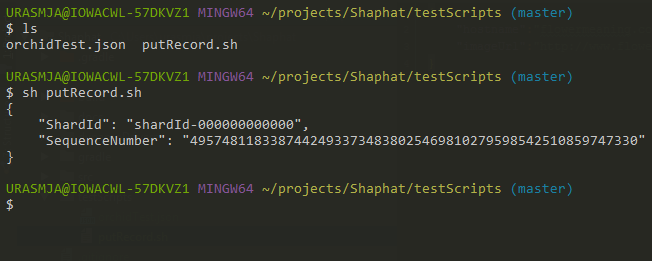
